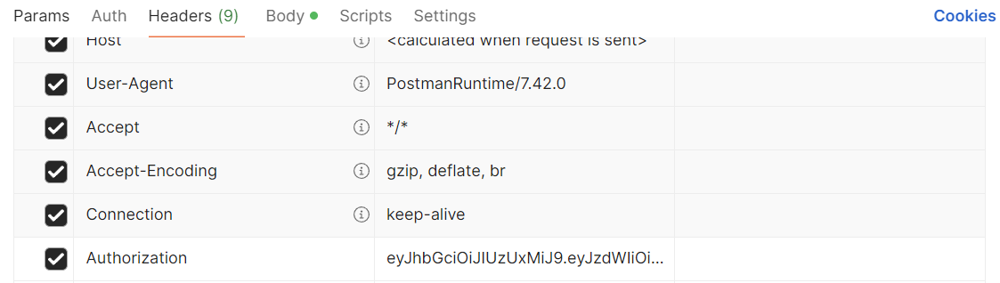
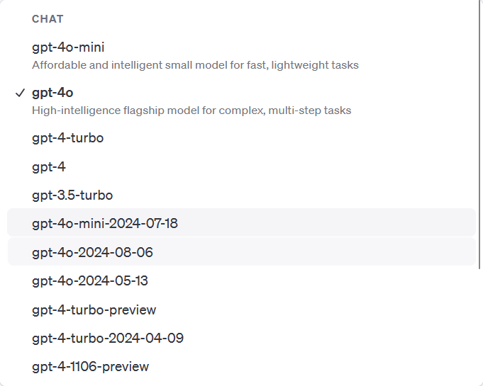
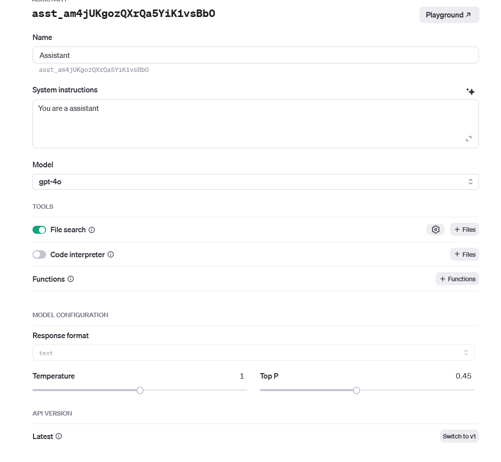

- #### API


##### System

- port: 8080

##### Login

###### Loc

```
/login
```

###### Permissions

null

###### Input

type：**POST**

| String | username |
| ------ | -------- |
| String | password |

###### Output

Success：

```
{
    "code": 200,
    "message": "Login Success",
    "data": {
        "isTeacher": "true", 
        "user": {
            "username": Username,
            "isTeacher": true
        },
        "token": "your token"
    }
}
```

Failure：

```
{
    "code": 500,
    "message": "Login verification failed, please log in again"
}
```

##### Assistant

**ForUnity**:

###### /assistant/getSubjects

Input：

- type:GET 

- The **Authorization** field in the Header carries the Jwt token

  

Output：

Identity authentication successful：

```
{
{
    "code": 200,
    "message": "Subjects get success!",
    "data": [
        {
            "name": "mole",
            "identifyId": "90016",
            "description": "a subject about management"
        },
        {
            "name": "kknd",
            "identifyId": "90014",
            "description": "a subject about practise"
        }
    ]
}
```


Failure：

```
{
    "code": 500,
    "message": "Login verification failed, please log in again"
}
```


###### /admin/assistant/getSubjects

Input：

- type:GET

- The **Authorization** field in the Header carries the Jwt token

  

Output：

Success：

```
{
    "code": 200,
    "message": "Subjects get success!",
    "data": [
        {
            "id": "1",
            "name": "mole",
            "identifyId": "90016"
        },
        {
            "id": "2",
            "name": "kknd",
            "identifyId": "90014"
        }
    ]
}
```


###### /admin/assistant/getAssistantBySubjectId

Get assistant based on subject identuifyId

Input：

- type:Get 

- The **Authorization** field in the Header carries the Jwt token

  

- Put the selected subject **identifyId** as a Param field in the request


​	：`/admin/assistant/getAssistantBySubjectId?subjectIdentifyId= 123321`

Output：

**Success**：

```
    "code": 200,
    "message": "Obtain assistants success!",
    "data": [
        {
            "id": 
            "name": 
            "subjectId": 
            "instructions": ,
            "description": ,
            "model": ,
            "identifyId": 
        }
    ]
```


**Failure**：

```
{
    "code": 500,
    "message": "Login verification failed, please log in again"
}
```

###### /admin/assistant/getAllAssistants

Get all assistants

Input：

- type:GET 

- The **Authorization** field in the Header carries the Jwt token

  

  

Output：

**Success**：

```
{
    "code": 200,
    "message": "Assistants get success!",
    "data": {
       //List of all the available assistants
    }
}
```

The returned Assistant has the following information

```
AiAgent

{
String id; // assistant corresponding id
String desciption; // introduction to assistant
String instruction // instructions for assistant
String model // AI model
String identifyId // id returned by OpenAI
}
```

**Failure**：

```
{
    "code": 500,
    "message": "Login verification failed, please log in again"
}
```


###### /admin/assistant/createAssistant

Input：

- type:POST 

- The **Authorization** field in the Header carries the Jwt token

  

  


- parameter

  | identifyId  | String | Remote ID of the assistant    |
  | ----------- | ------ | ----------------------------- |
  | name        | Srting |                               |
  | model       | String |                               |
  | temperature | Double | Answer randomness             |
  | topP        | Double | Sampling level                |
  | instruction | String | Instructions to the assistant |
  | description | String | Description of the assistant  |
  | subjectId   | String |                               |

The selected model should be one of the following:



The operation interface should be similar to the following figure:



Output：

**Success**：

```
{
    "code": 200,
    "message": "Assistants get success!",
    "data": {
       //Returns the information of the assistant after creation
    }
}
```

The returned Assistant has the following information

```
AiAgent

{
String id; // assistant corresponding id
String desciption; // introduction to assistant
String instruction // instructions for assistant
String model // AI model
String identifyId // id returned by OpenAI
}
```

**Failure**：

```
{
    "code": 500,
    "message": "Login verification failed, please log in again"
}
```

###### /admin/assistant/updateAssistant

Input：

- type:POST 

- The **Authorization** field in the Header carries the Jwt token

  

  


- parameter

  | identifyId  | String | Remote ID of the assistant    |
  | ----------- | ------ | ----------------------------- |
  | name        | Srting |                               |
  | model       | String |                               |
  | temperature | Double | Answer randomness             |
  | topP        | Double | Sampling level                |
  | instruction | String | Instructions to the assistant |
  | description | String | Description of the assistant  |
  | subjectId   | String |                               |

Output：

**Success**：

```
{
    "code": 200,
    "message": "Assistants get success!",
    "data": {
       "Assistant update success!"
    }
}
```


##### File

###### /admin/uploadFile

Input：

- type:POST 

- The **Authorization** field in the Header carries the Jwt token

  

  


- parameters

  |             |        |                             |
  | ----------- | ------ | --------------------------- |
  | file        | File   | Uploaded files              |
  | assistantId | String | identifyId of the assistant |
  |             |        |                             |

  

返回：

**Success**：

```
{
    "code": 200,
    "message": "upload file success!",
    "data": {
		"id": //file id
		"fileName": //file name
		"date": //upload date
		"assistantId": //corresponding assistant identifyId
    }
}
```


**Failure**：

```
{
    "code": 500,
    "message": "information is incomplete"
}
```

###### /getFileByAssitantId?assistantId=

Input：

- type:**GET** 

- The **Authorization** field in the Header carries the Jwt token

  

  


- parameter

  /getFileByAssitantId?assistantId=

Output：

**Success**：

```
{
    "code": 200,
    "message": "get file success!",
    "data": [
        "file-iwEMpHEA99MIMHYEQTlPnKQs" //可用文件id构成的列表
    ]
}
```

**Failure**

```
{
    "code": 500,
    "message": "Assistant Id con not be empty"
}
```


###### /admin/getAllFiles

Input：

- type:**GET** 

- The **Authorization** field in the Header carries the Jwt token

  

  


- parameter

  localhost:8080/getFileByAssitantId?**assistantId**=assistantidentifyId

Output：

**Success**：

```
{
       "code": 200,
    "message": "get file success!",
    "data": [
        {
            "id": "file-iwEMpHEA99MIMHYEQTlPnKQs", //fileid
            "fileName": "api.txt", //doc name
            "date": "2024-10-05T14:00:00.000+00:00", //creation date
            "assistantId": "asst_E93kjmZ9vIO5IQMTPjCvX9Xd" //assistantIdentifyId
            
        }
    ]
}
```

### StudentInfo API

- port: 8080

##### Authorization

JWT Token is required for authentication.

##### Request Method

**POST**

##### Endpoint

```
/admin/addStuToSub
```

##### Input

| Field Name        | Type   | Description                             |
| ----------------- | ------ | --------------------------------------- |
| studentId         | String | The user ID associated with the student |
| subjectIdentifyId | String | The student's list of selected subjects |

##### Sample Request

```json
{
    "studentId":"5ba016a59c4c821392f00dc0a1901b81",
    "subjectIdentifyId":"90015"
}
```

##### Response

**Success**:

```
{
    "code": 200,
    "message": "Insert subject Success!",
    "data": null
}
```

**Failure**:

```
{
    "code": 500,
    "message": "Subject has already been added",
    "data": null
}

{
    "code": 500,
    "message": "user does not exist",
    "data": null
}
```

### Subject API

#### /subject/add

Add Subject

##### Request Method

**POST**

##### URL

/admin/subject/add

##### Input

| Field Name  | Type   | Description           |
| ----------- | ------ | --------------------- |
| name        | String | Subject Name          |
| identifyId  | String | Subject Identifier ID |
| description | String | Subject Description   |

##### Example Request

```
{
    "name":"SWEN90016",
    "identifyId":"90016",
    "description":"90016test"
}
```

##### Response

**Success**:

```
{
    "code": 200,
    "message": "Subject added successfully!",
    "data": null
}
```

**Failure**:

```
{
    "code": 500,
    "message": "Failed to add subject"
}
```

#### /subject/delete/{identifyId}

Delete Subject

##### Permissions

None

##### Request Method

**DELETE**

##### URL

/admin/subject/delete/{identifyId}

##### Input

Pass in the `Subject ID` as a path parameter.

##### Example Request

DELETE  /subject/delete/90016

##### Response

**Success**:

```
{
    "code": 200,
    "message": "Subject deleted successfully!"
}
```

**Failure**:

```
{
    "code": 500,
    "message": "Failed to delete subject"
}
```

#### /subject/update

Update Subject Information

##### Permissions

None

##### Request Method

**PUT**

##### URL

/admin/subject/update

##### Input

| Field Name  | Type   | Description           |
| ----------- | ------ | --------------------- |
| name        | String | Subject Name          |
| identifyId  | String | Subject Identifier ID |
| description | String | Subject Description   |

##### Example Request

```
{
    "name":"swen90016",
    "identifyId":"90016",
    "description":"90016test2"

}
```

##### Response

**Success**:

```
{
    "code": 200,
    "message": "Subject updated successfully!",
    "data":null
}
```

**Failure**:

```
{
    "code": 500,
    "message": "Failed to update subject"
}
```

#### /subject/get/{identifyId}

Retrieve by Subject ID

##### Permissions

None

##### Request Method

**GET**

##### URL

/admin/subject/get/{identifyId}

##### Input

Pass in the `Subject ID` as a path parameter.

##### Example Request

```
GET /admin/subject/get/90016
```

##### Response

**Success**:

```
{
    "code": 200,
    "message": "Subject retrieved successfully!",
    "data": {
        "id": "a85986996927ab27d98c56bde5d2bcbf",
        "name": "swen90016",
        "identifyId": "90016",
        "description": "90016test2"
    }
}
```

**Failure**:

```
{
    "code": 500,
    "message": "Subject not found."
}
```

