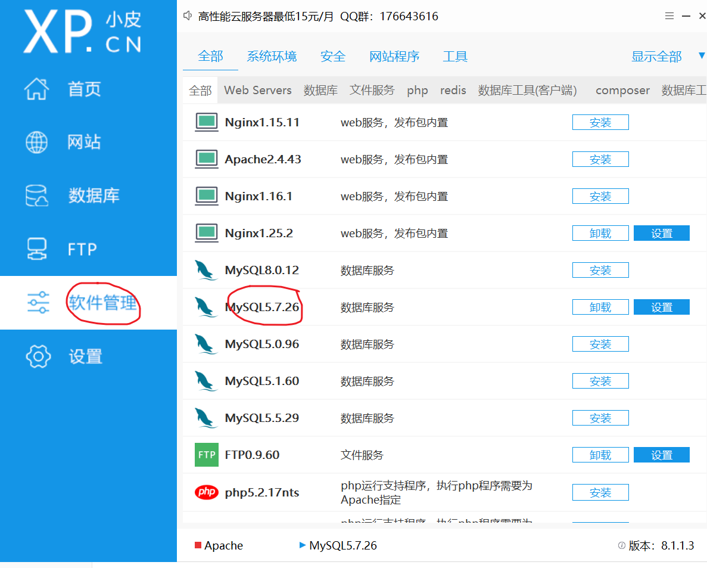
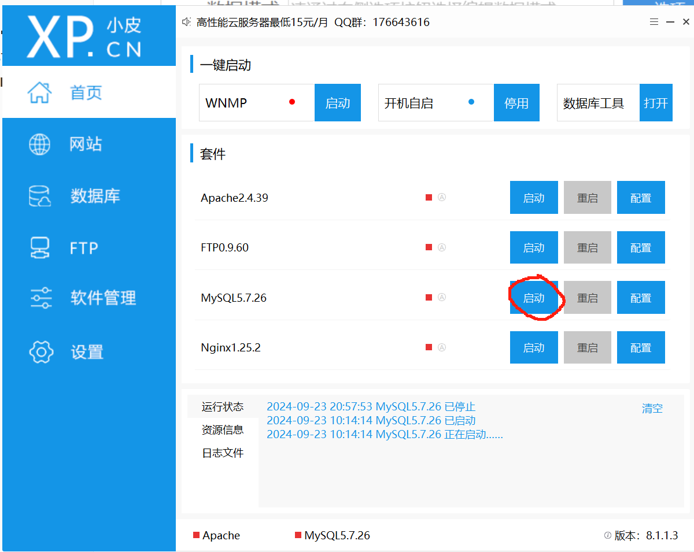
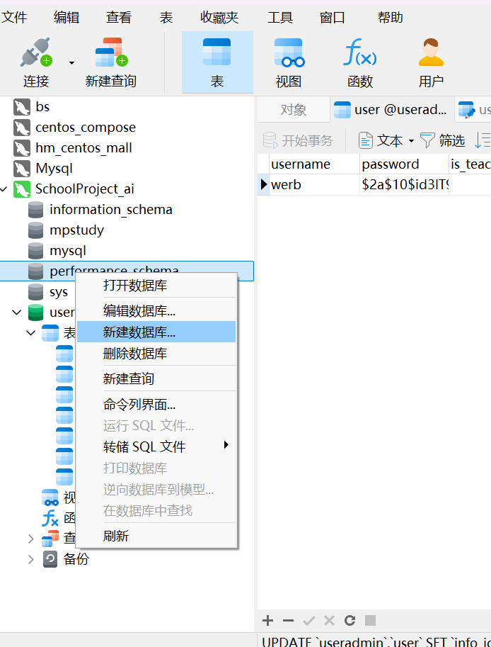
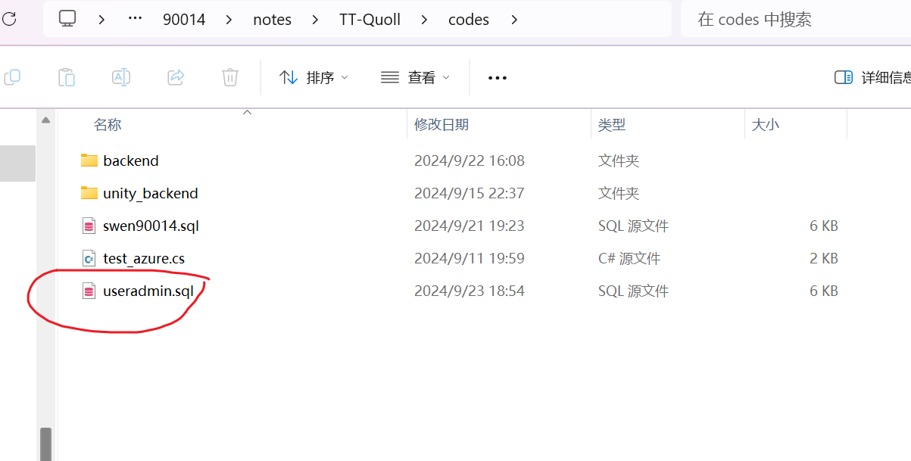
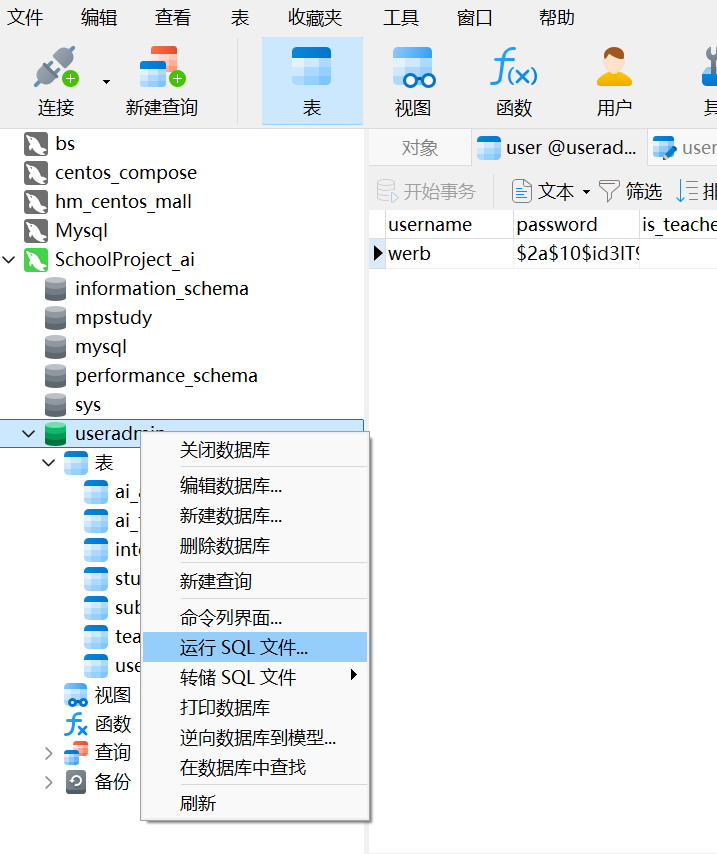
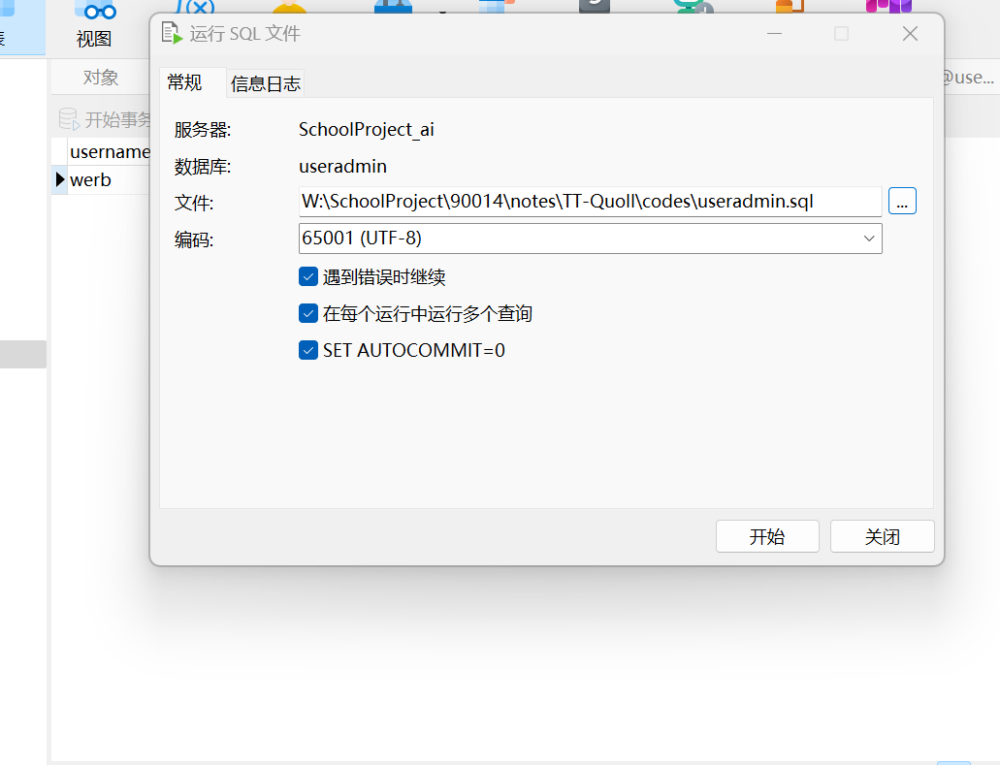
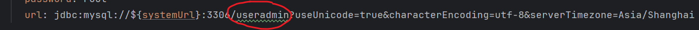
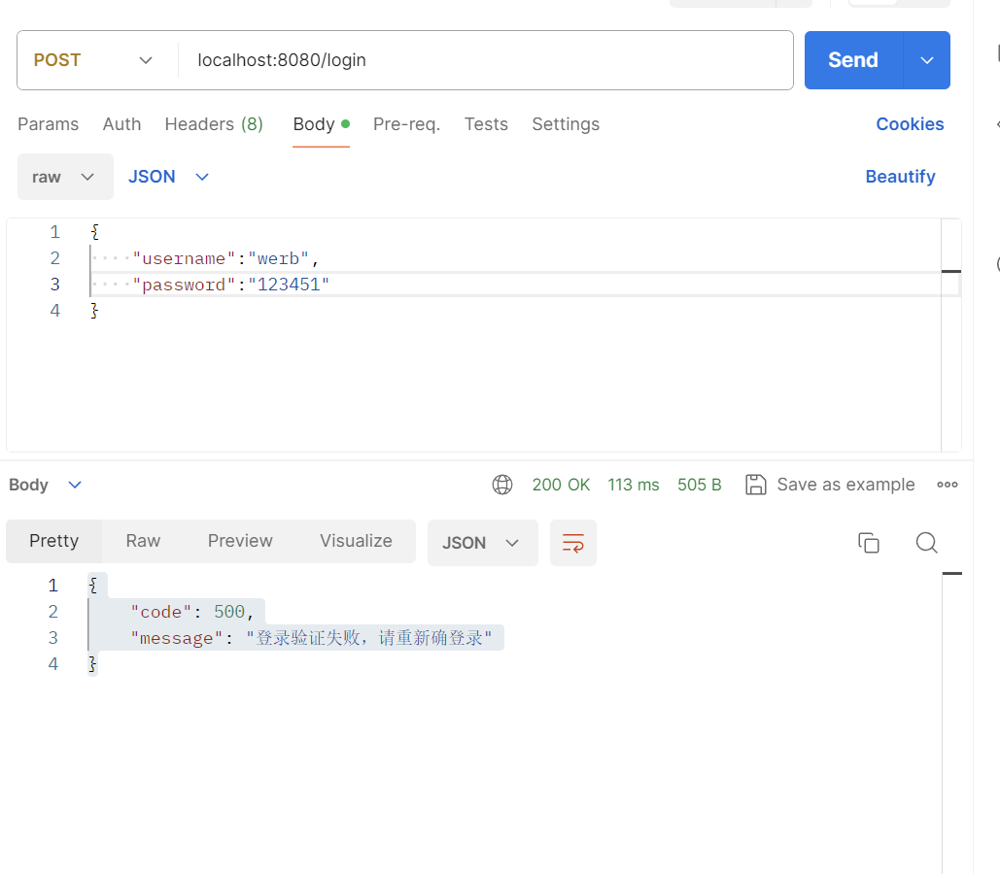
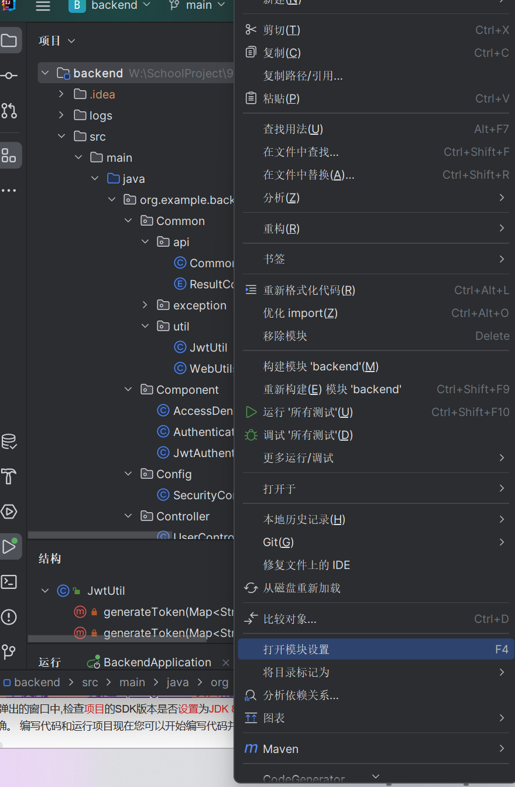

##### PHP STUDY

①Download the corresponding version of mysql

②Configure

Confirm that the port is 3306

③Start

##### Navicate

① Create a database link

***Set your own account password***

②New database

③Import the sql structure in the newly created database

After running the file **Reclose and open the **database again to see the table structure appear in the library:

##### SpringBoot

①Open the project

Open `code/Backend` in the project file with **JIDEA**.

②Adjusting Settings

- Write your data account password

  

- Write the name of your database library

③ Initiation of projects

Tap `BackendApplication`.

Click here to start

Then we can access the corresponding port (8080) on the local machine (I'm using Postman here)

##### Java version

Right click on the root module and open the module settings.

②Set to 1.8/8

