##### PHP STUDY

①下载对应版本的mysql

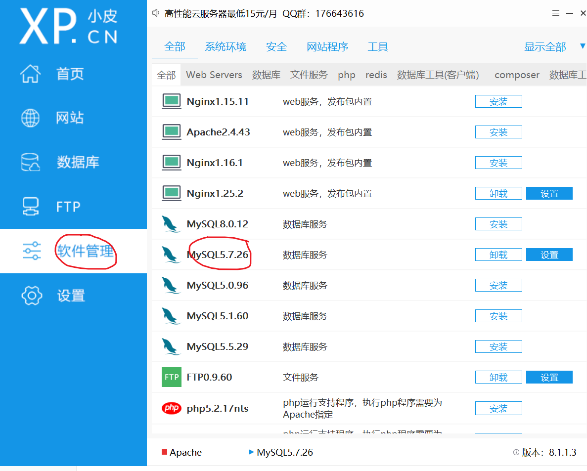

②进行配置

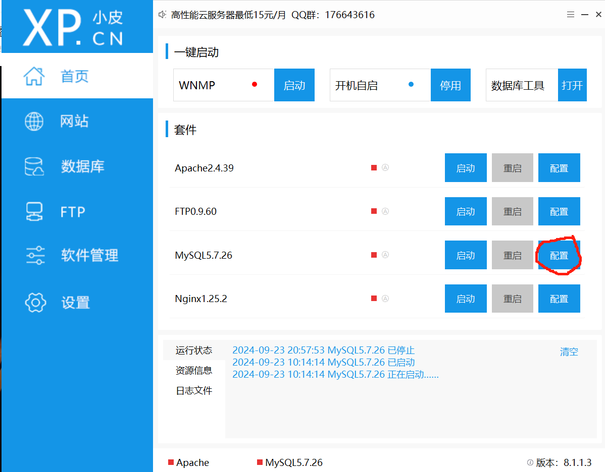

确认端口为3306

③启动

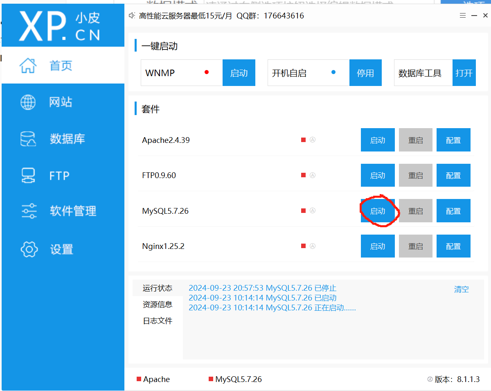

##### Navicate

①创建一个数据库链接

**设置自己的账号密码**

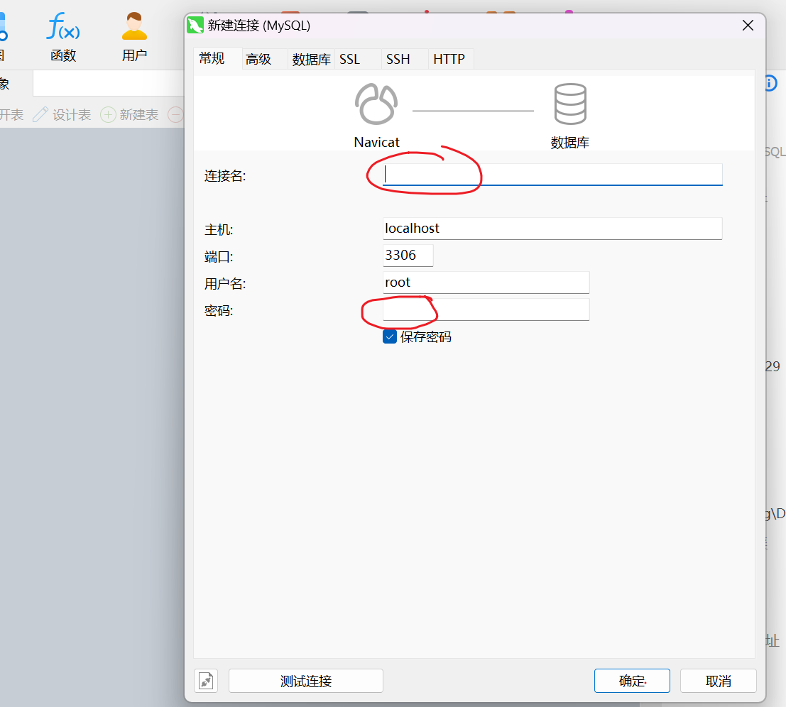

②新建数据库

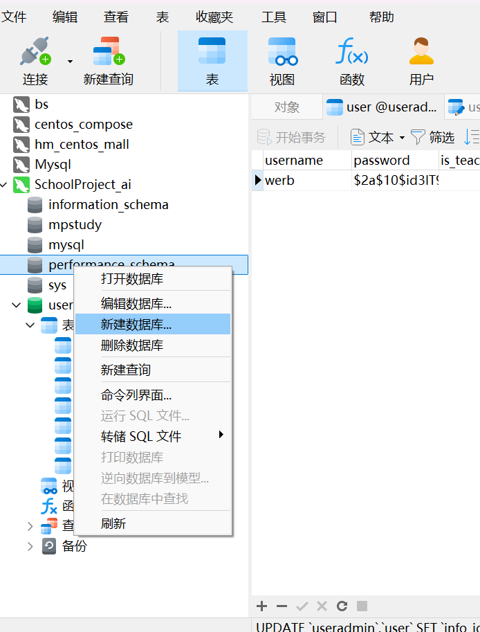

③在新建的数据库中导入sql结构

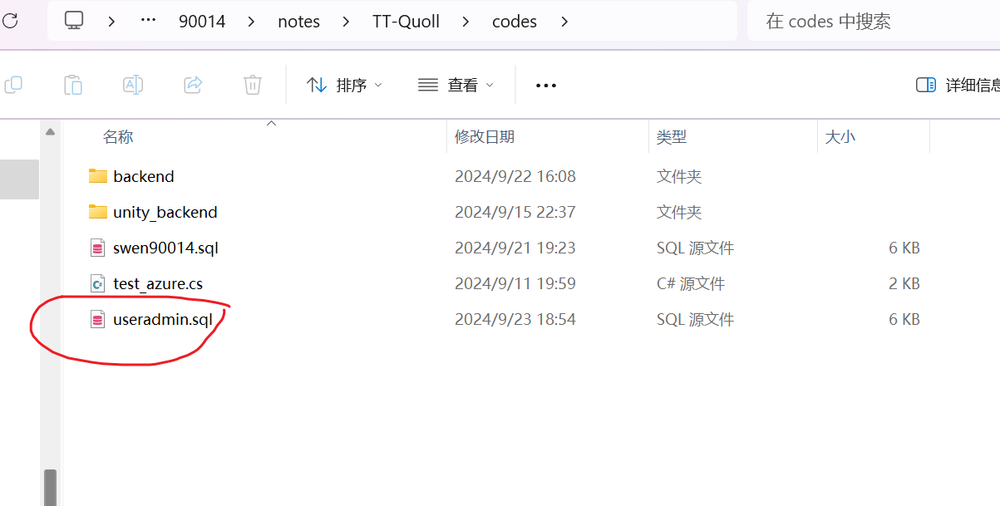

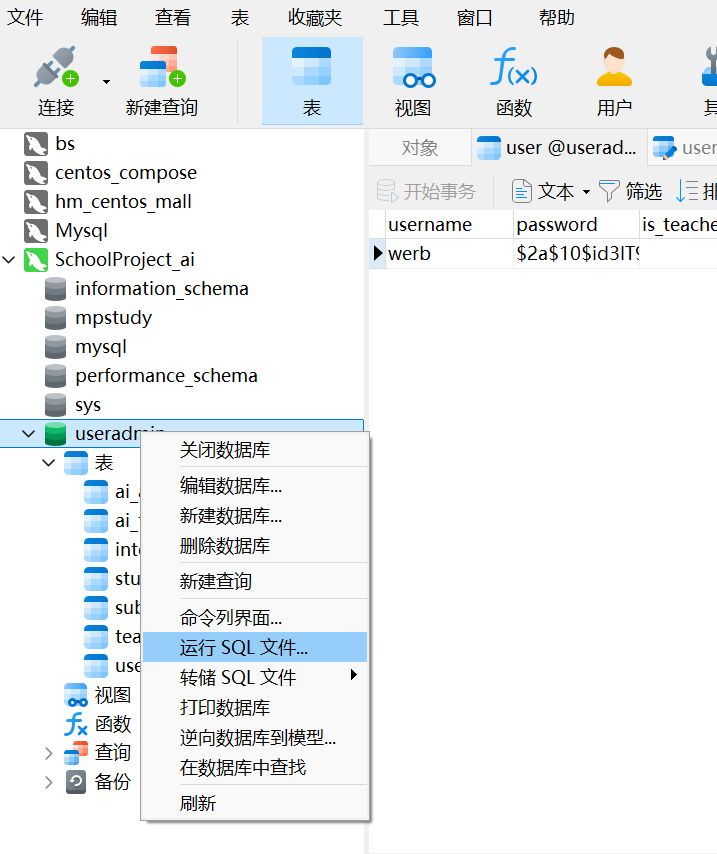

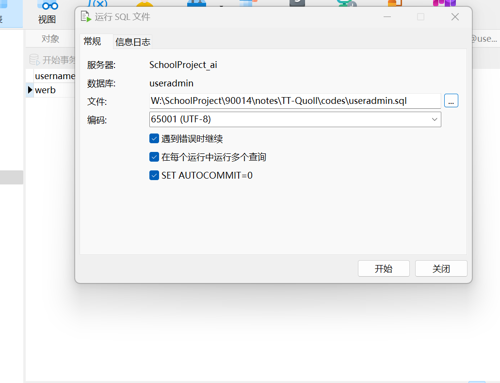

运行文件后**重新关闭并打开**数据库即可看到表结构出现在库中：

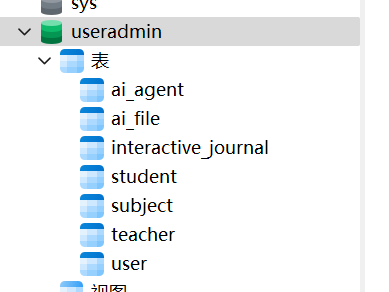

##### SpringBoot

①打开项目

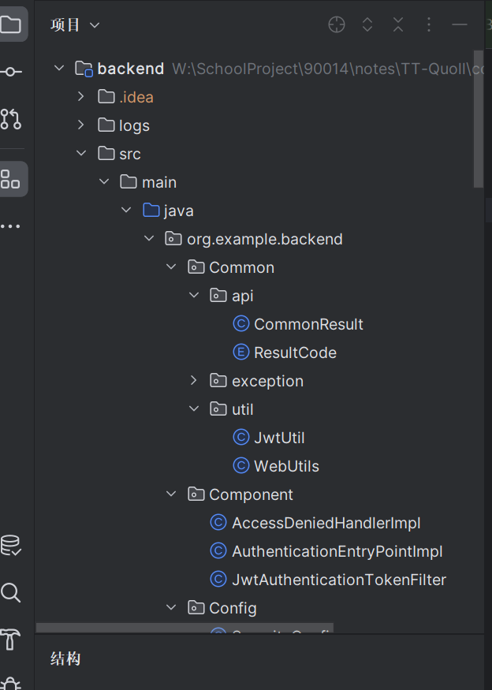

用**JIDEA**打开项目文件中的 `code/Backend`

②调整设置

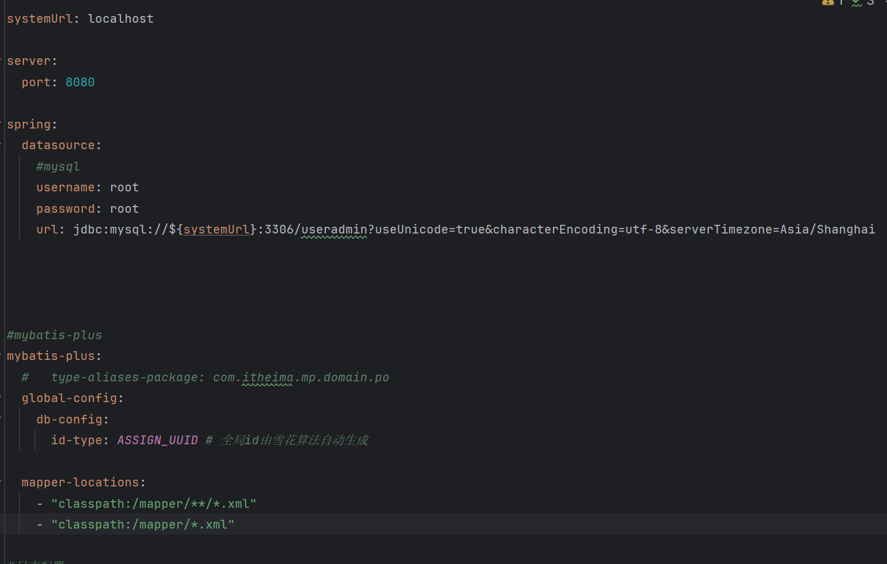

- 写入你的数据账号密码

  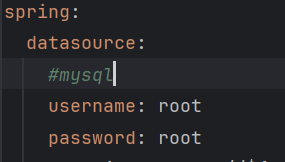

- 写入你的数据库库名

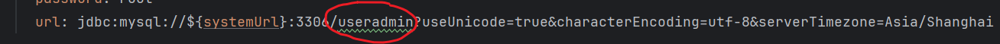

③启动项目

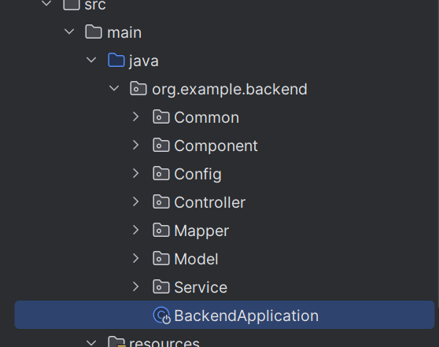

点开`BackendApplication`

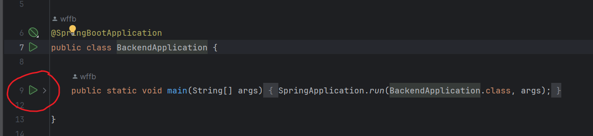

点此即可启动

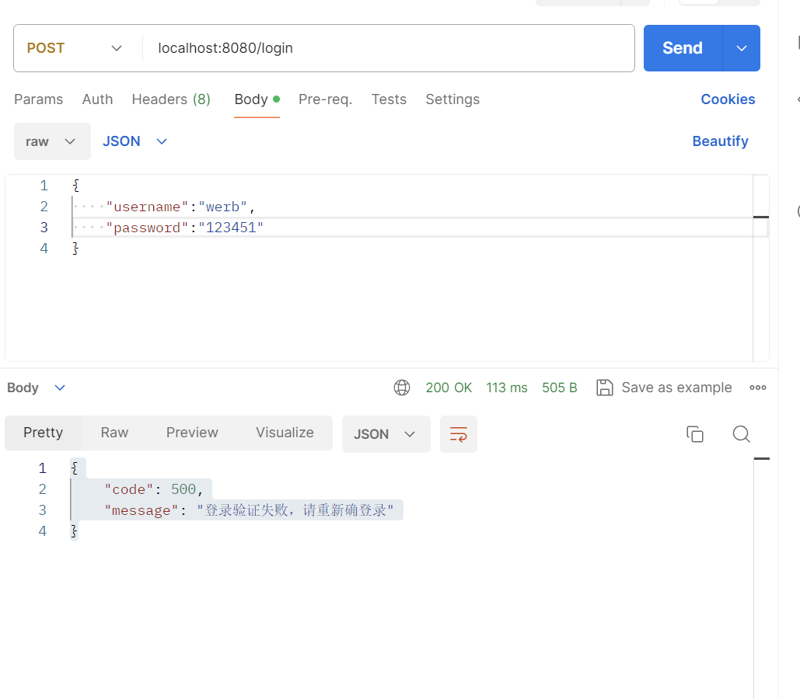

随后我们就可以在本机对应的端口(8080),访问对应（我这里使用的是Postman）

##### Java版本

①右键根模块，打开模块设置

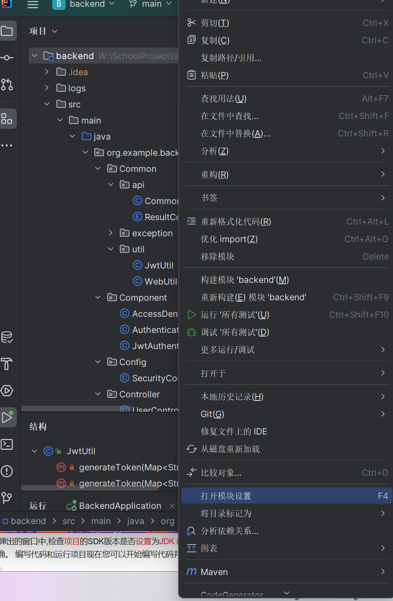

②设置为1.8/8

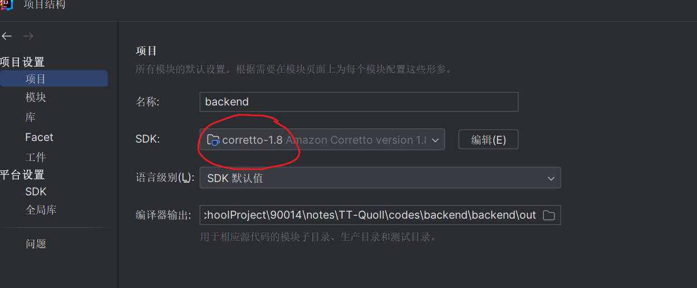

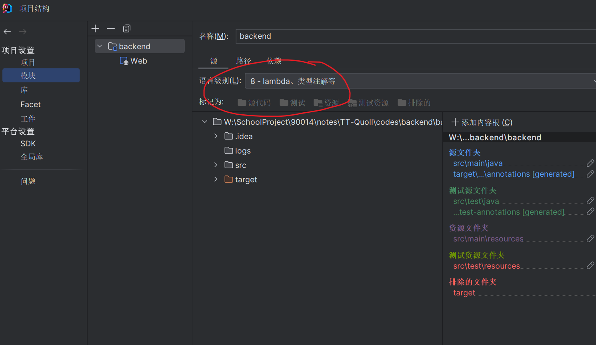