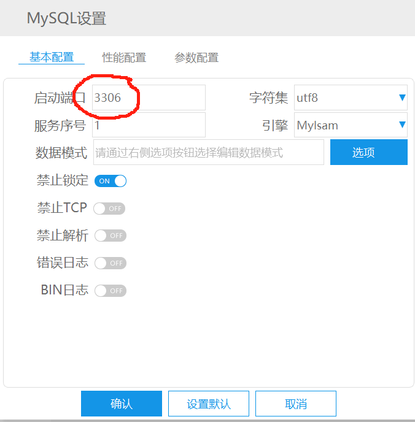
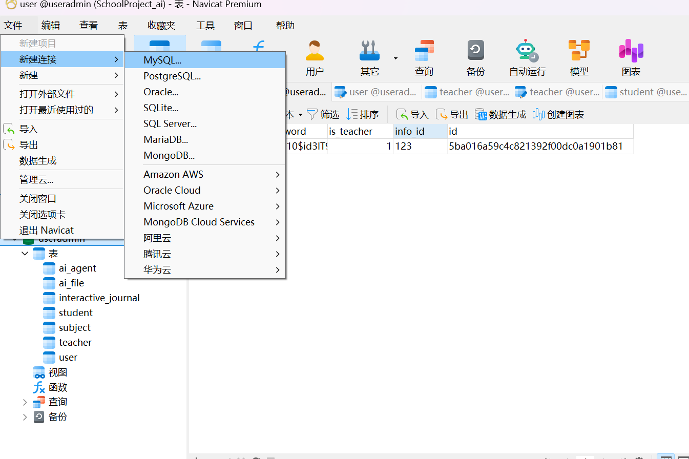

##### PHP STUDY

①下载对应版本的mysql

②进行配置

确认端口为3306

③启动

##### Navicate

①创建一个数据库链接

**设置自己的账号密码**

②新建数据库

③在新建的数据库中导入sql结构

运行文件后**重新关闭并打开**数据库即可看到表结构出现在库中：

##### SpringBoot

①打开项目

用**JIDEA**打开项目文件中的 `code/Backend`

②调整设置

- 写入你的数据账号密码

  

- 写入你的数据库库名

③启动项目

点开`BackendApplication`

点此即可启动

随后我们就可以在本机对应的端口(8080),访问对应（我这里使用的是Postman）

##### Java版本

①右键根模块，打开模块设置

②设置为1.8/8

