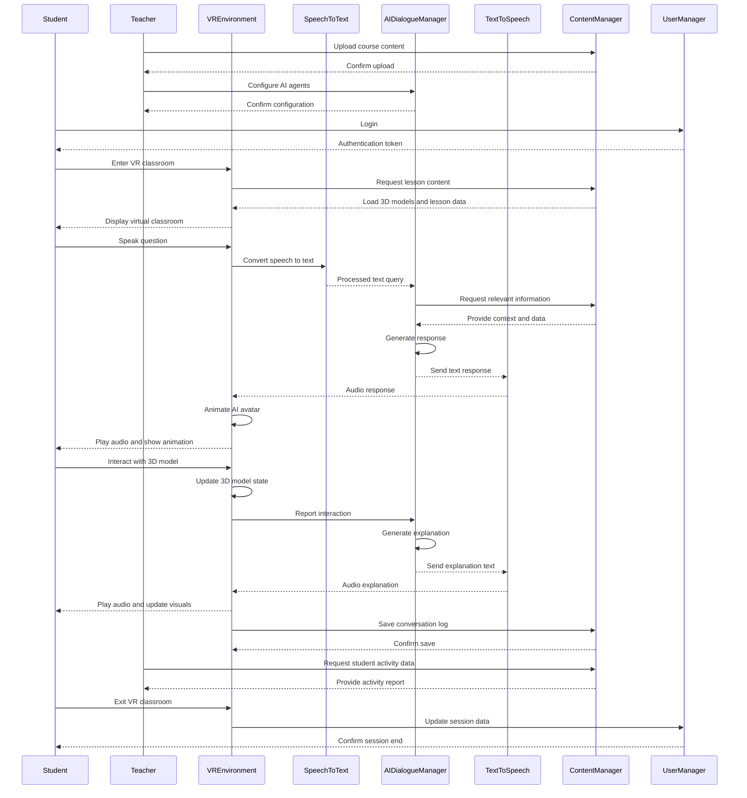

## System architecture diagram

## Sequential diagram

### Execution Scenario

This timing diagram describes the flow of teacher-student interaction in a virtual reality (VR) classroom system. The main participants in the diagram include the students, the teacher, the VR environment, the speech-to-text system, the AI dialogue manager, the text-to-speech system, the content manager, and the user manager. The following is a detailed description of each step in the timing diagram:

#### 1. **Teacher setup stage**

1. **Upload course content**.
   - **The teacher** uploads course content to the **Content Manager**.
   - The content Manager confirms the upload and replies to the **Teacher**.

2. **Configure AI Agent**.
   - **The teacher** configures **AI Dialogue Manager** to ensure the AI Agent is set up correctly.
   - **AI Dialogue Manager** Confirm configuration and reply to the **Teacher**.

#### 2. **Student Interaction Phase**

1. **Student Login**.
   - **Th**e student initiates a login request to the **User Manager**.
   - The **User Manager** verifies the student's identity and returns an authentication token. 2.

2. **Access to VR Classroom**: Students access the **VR Classroom**.
   - **The student** enters the **VR environment**.
   - The **VR environment** requests course content from the **Content Manager**.
   - The **Content Manager** loads the 3D model and course data and sends it to the **VR environment**.
   - The **VR Environment** displays the virtual classroom to the **Student**.

#### 3. **Students interact with AI**.

1. **Question**.
   - **The student** asks a question in the **VR Environment**.
   - The **VR environment** converts the speech to text and sends it to the **Speech to Text** system.
   - The **Speech to Text** system sends the processed text query to the **AI Dialogue Manager**.

2. **Processing queries**.
   - The AI Dialogue Manager requests relevant information from the Content Manager**.
   - **Content Manager** provides context and data to **AI Dialogue Manager**.
   - **AI Dialogue Manager** generates a response and sends a text response to the **Text-to-Speech** system.
   - The **Text-to-Speech** system generates an audio response and sends it to the **VR environment**.
   - The **VR environment** plays the audio and animates the image of the AI agent while displaying it to the **Student**.

#### 4. **Interacting with 3D models** 1.

1. **Interaction**.
   - **The student** interacts with the 3D model in the **VR Environment**.
   - The **VR Environment** updates the state of the 3D model.
   - The **VR environment** sends the AI dialogue manager a report of the interaction.
   - **AI Dialogue Manager** generates explanatory text and sends it to the **Text-to-sp**eech system.
   - **The text-to-speech** system generates audio interpretation and sends it to the.
   - The **VR Environment** plays the audio interpretation and updates the visual display for the **Student**.

#### 5. **Save the dialogue record**

- The **VR environment** saves the dialogue record to the **Content Manager**.
- The content Manager Confirms the save operation and replies to the **VR Environment**.

#### 6. **Teacher Monitor**

- The teacher requests the **Content Manager** to provide student activity data.
- The content Manager provides activity reports to the **Teacher**.

#### 7. **Student Exit**

- **The student** exits the **VR environment**.
- **VR Environment** Updates session data to the **User Manager**.
- The user Manager Acknowledges the end of the session and replies to the **Student**.

